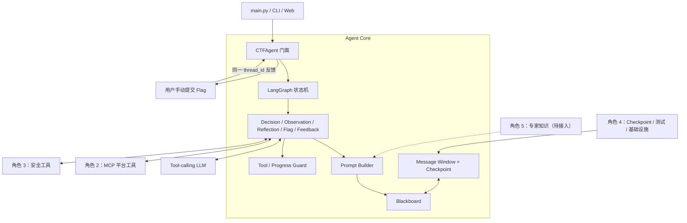
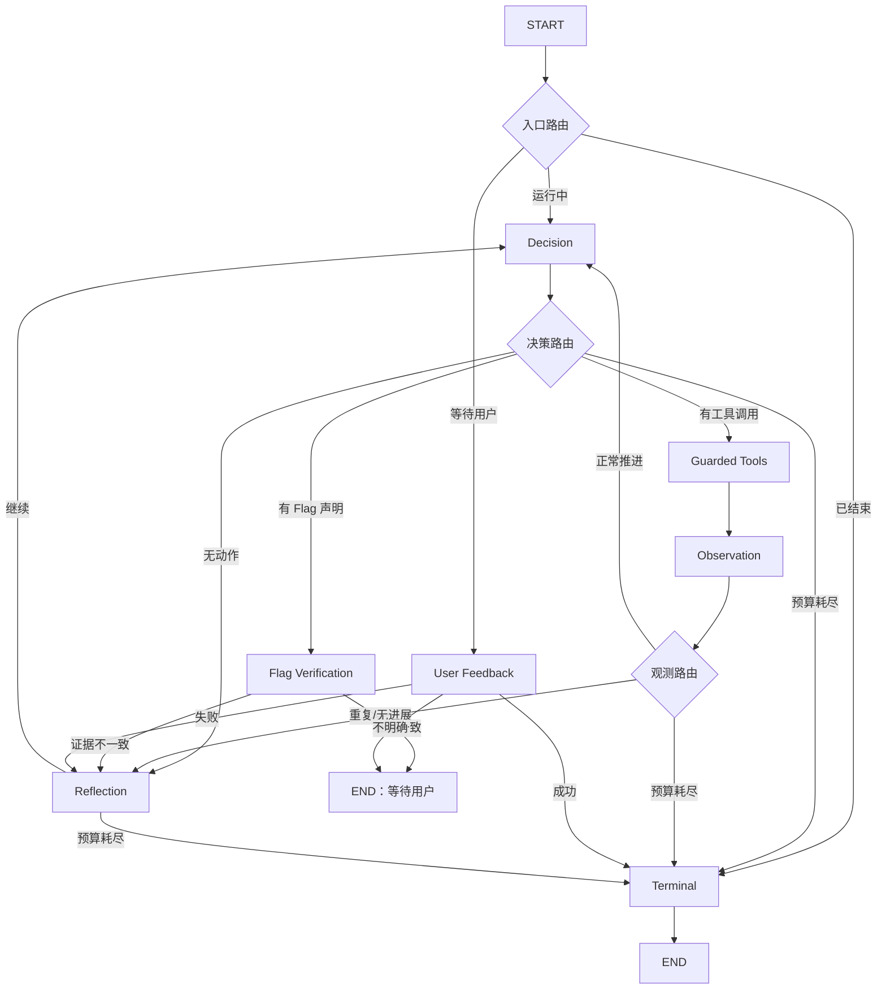
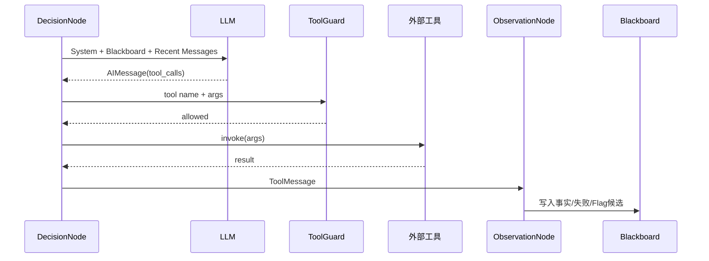
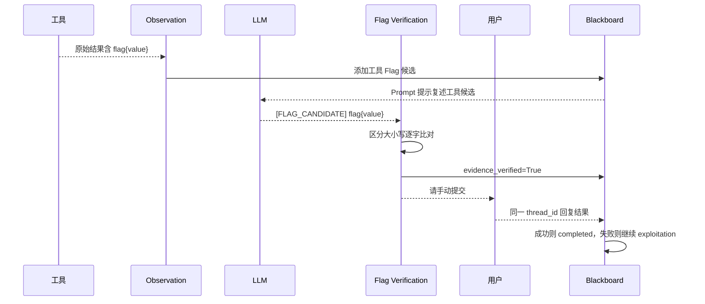

# Agent Core 详细设计文档

## 1. 总体设计

### 1.1 设计目标

Agent Core 是 CTF Agent 的决策和状态中心。它不直接实现平台通信、HTTP 请求或
代码执行，而是负责：

1. 理解题目和当前目标。
2. 维护结构化黑板。
3. 根据黑板调用 LLM 做下一步决策。
4. 调度角色 2、3 提供的工具。
5. 把真实工具结果写回黑板。
6. 检测重复失败并强制反思。
7. 对 Flag 执行 LLM 输出与工具证据双重验证。
8. 暂停并等待用户手动提交结果。
9. 使用 checkpoint 在同一会话恢复状态。

### 1.2 非目标

当前 MVP 不负责：

- MCP 连接和平台认证。
- HTTP、Shell、Python 工具内部实现。
- 自动向平台提交 Flag。
- 多 Agent 并行协作。
- 向量数据库和长期知识库。
- 自动生成完整渗透测试报告。
- 生产级日志和事件总线。

### 1.3 核心设计原则

#### 黑板是事实来源

消息历史只用于保持短期对话连续性。已确认事实、失败尝试、攻击路径、假设和
Flag 状态全部由 Blackboard 保存。

#### 事实和推测分离

- 工具输出可以生成已确认观测。
- LLM 只能提出假设，不能自行制造事实。
- 专家知识只能辅助提出假设。
- Flag 必须经过工具证据、LLM 复述和用户提交三层确认。

#### 控制逻辑确定化

重复检测、Flag 字符串比对、状态切换和执行预算都由 Python 代码完成，不交给
LLM 自行判断。

#### 外部能力依赖注入

模型、工具、配置和 checkpointer 都从 `create_ctf_agent` 注入，Core 不依赖具体
模型厂商、MCP Server 或工具实现。

---

## 2. 总体架构



### 2.1 分层

| 层 | 目录/模块 | 主要职责 |
|---|---|---|
| 公共入口层 | `agent.py`、`__init__.py` | 创建 Agent、启动和恢复任务 |
| 图编排层 | `graph.py` | 节点注册、条件路由、终止条件 |
| 状态层 | `state/` | 黑板、记录模型、checkpoint 状态 |
| 决策层 | `nodes/` | 模型决策、工具执行、观测、反思、Flag、反馈 |
| 约束层 | `middleware/` | 调用指纹、重复检测、执行预算 |
| Prompt 层 | `prompts/` | 固定规则、Few-Shot、动态黑板视图 |
| 短期记忆层 | `memory/` | 消息窗口裁剪和工具消息配对 |
| 协议层 | `contracts.py` | 模型和工具的结构化接口 |
| 配置层 | `config.py` | 阈值、长度限制、Flag 模式 |

---

## 3. 文件结构

```text
core/
├── __init__.py
├── agent.py
├── graph.py
├── config.py
├── contracts.py
├── README.md
├── AGENT_CORE_INTERFACES.md
├── AGENT_CORE_DETAILED_DESIGN.md
│
├── state/
│   ├── __init__.py
│   ├── models.py
│   ├── blackboard.py
│   └── agent_state.py
│
├── prompts/
│   ├── __init__.py
│   ├── system.py
│   ├── builder.py
│   └── few_shots.py
│
├── nodes/
│   ├── __init__.py
│   ├── decision.py
│   ├── execution.py
│   ├── observation.py
│   ├── reflection.py
│   ├── flag_verification.py
│   ├── user_feedback.py
│   └── terminal.py
│
├── middleware/
│   ├── __init__.py
│   ├── tool_guard.py
│   └── progress_guard.py
│
└── memory/
    ├── __init__.py
    └── history.py
```

---

## 4. 分模块详细设计

## 4.1 公共入口模块

### 4.1.1 `core/__init__.py`

#### 职责

作为包的稳定导出面。外部模块优先从 `core` 导入，不依赖内部目录结构。

#### 当前导出

```python
AgentRunResult
AgentStatus
Blackboard
CTFAgent
CTFAgentState
CoreConfig
create_ctf_agent
```

#### 设计约束

- 节点类和内部辅助函数不从这里导出。
- 后续重构内部文件时，公共导入路径尽量保持稳定。

### 4.1.2 `core/agent.py`

#### 总体职责

向项目入口提供简单的任务生命周期 API，隐藏 LangGraph 的内部节点和路由细节。

#### `create_ctf_agent`

处理流程：

1. 解析 `CoreConfig`。
2. 遍历所有工具并获取稳定名称。
3. 检查工具名称冲突。
4. 过滤 `submit_flag` 等隐藏工具。
5. 使用 `model.bind_tools` 绑定剩余工具。
6. 创建默认 `InMemorySaver` 或使用外部 checkpointer。
7. 调用 `build_graph` 编译图。
8. 返回 `CTFAgent`。

#### `CTFAgent.start`

处理流程：

1. 校验 `task` 和 `thread_id`。
2. 创建新的 Blackboard。
3. 将 Blackboard 序列化为 JSON 字典。
4. 把任务作为首条 `HumanMessage`。
5. 使用 `thread_id` 调用图。
6. 将最终状态转换成 `AgentRunResult`。

#### `CTFAgent.resume`

处理流程：

1. 根据 `thread_id` 查询 checkpoint。
2. 如果不存在会话则抛出 `LookupError`。
3. 将用户回复追加为 `HumanMessage`。
4. 从保存的图状态继续执行。
5. 返回新的 `AgentRunResult`。

#### `AgentRunResult`

该对象只包含调用方最常用的结果：

```text
response                  最后一条助手回复
status                    当前生命周期状态
awaiting_user_submission  是否等待用户提交
blackboard                完整可读状态
```

### 4.1.3 `core/config.py`

#### 职责

集中保存所有影响循环行为的参数，避免阈值散落在节点代码中。

#### 配置分类

| 分类 | 参数 |
|---|---|
| 执行预算 | `max_steps`、`recursion_limit` |
| 防循环 | `repeat_failure_threshold`、`reflection_threshold` |
| 上下文控制 | `message_window`、`evidence_excerpt_chars` |
| 黑板展示 | `max_facts_in_prompt`、`max_failures_in_prompt`、`max_hypotheses_in_prompt` |
| Flag | `flag_patterns`、`hidden_tool_names` |

`CoreConfig` 使用 Pydantic 校验上下界，并设置为冻结对象。

### 4.1.4 `core/contracts.py`

#### 职责

定义 Core 依赖的最小能力接口，避免直接依赖某个具体 LLM SDK。

#### 模型协议

```text
ToolCallingModel
    └── bind_tools(tools) -> BoundChatModel

BoundChatModel
    └── ainvoke(messages) -> AIMessage
```

#### 工具协议

```text
ToolLike = BaseTool | Callable
```

`tool_name` 优先读取工具的 `name`，否则读取函数 `__name__`。

---

## 4.2 状态与黑板模块

### 4.2.1 `state/models.py`

#### 总体职责

定义可序列化、可验证的领域记录。

#### 状态枚举

```text
CTFPhase
├── information_gathering
├── vulnerability_analysis
├── exploitation
├── flag_review
└── completed

AgentStatus
├── running
├── awaiting_user_submission
├── completed
└── failed
```

#### 核心记录

##### `ChallengeContext`

保存题目 ID、标题、任务和目标。

##### `Fact`

保存工具确认的事实：

```text
id
content
source_tool
source_call_id
evidence
created_at
```

`source_tool` 和 `source_call_id` 用于追溯事实来源。

##### `FailedAttempt`

保存失败动作及重复次数：

```text
tool_name
normalized_args
call_fingerprint
result_fingerprint
result_summary
error_type
repeat_count
```

##### `AttackPath`

保存当前主路径，不在 MVP 中并行维护多个活跃路径：

```text
name
goal
next_step
status
blocked_reason
```

##### `Hypothesis`

保存模型尚未验证的推测和建议验证动作。

##### `FlagCandidate`

保存 Flag 三阶段状态：

```text
工具中出现
    → llm_claimed
    → evidence_verified
    → user_submission_status
```

### 4.2.2 `state/blackboard.py`

#### 总体职责

Blackboard 是当前任务的规范状态模型，也是 Prompt 动态上下文的来源。

#### 黑板主体

```text
Blackboard
├── challenge
├── phase
├── confirmed_facts[]
├── failed_attempts[]
├── current_path
├── hypotheses[]
├── flag_candidates[]
├── awaiting_user_submission
├── step_count
├── no_progress_count
├── reflection_count
├── reflection_guidance
├── last_failure_signature
├── failure_streak
└── status
```

#### 更新原则

- 节点先调用 `copy_for_update` 创建深拷贝。
- 修改副本后返回新的状态。
- 节点不直接原地修改 checkpoint 中的对象。
- 重复 Fact 不重复插入。
- 相同失败签名连续出现时增加 `repeat_count`。
- 工具成功后清空当前失败连续计数。

#### Flag 状态规则

`add_tool_flag`：

- 只记录工具真实输出中提取的 Flag。
- 已被用户判定错误的相同 Flag 不会重新进入待提交队列。

`verify_llm_flag`：

- 使用区分大小写的完整字符串比较。
- 匹配成功后进入 `flag_review`。
- 设置 `awaiting_user_submission=True`。

`mark_user_submission`：

- 成功：状态进入 `completed`。
- 失败：候选标记为失败，返回 `exploitation`。

### 4.2.3 `state/agent_state.py`

#### 职责

定义 LangGraph 共享状态：

```python
class CTFAgentState(TypedDict, total=False):
    messages: Annotated[list[BaseMessage], add_messages]
    blackboard: dict[str, Any]
```

消息使用 `add_messages` reducer，确保节点返回的新消息被追加。

Blackboard 在 checkpoint 中保存为纯 JSON 字典，原因是：

- 避免自定义 Pydantic 类型的序列化白名单问题。
- 兼容不同持久化后端。
- 降低 LangGraph 版本升级风险。

节点入口调用 `read_blackboard` 恢复 Pydantic 模型，节点出口调用
`write_blackboard` 转回 JSON 字典。

---

## 4.3 Prompt 模块

### 4.3.1 `prompts/system.py`

#### 职责

保存稳定、精简的最高层规则。

#### 内容组成

1. CTF 沙盒身份。
2. 信息收集到 Flag 证据确认的工作流。
3. 工具真实性规则。
4. 假设与事实分离规则。
5. 黑板指令格式。
6. Flag 双重验证协议。
7. 禁止自动调用 `submit_flag`。

#### 黑板指令

模型可以输出：

```text
[PATH] 路径名称 | 目标 | 下一步
[HYPOTHESIS] 假设内容 | 验证动作
[CONFIRM] 假设ID
[REJECT] 假设ID
[FLAG_CANDIDATE] 原始Flag
```

这些指令由 Core 解析，模型不能直接修改 Blackboard 对象。

### 4.3.2 `prompts/few_shots.py`

#### 职责

提供一个短小的成功样例，教模型：

- 先写攻击路径和假设。
- 再调用工具验证。
- 不重复失败请求。
- 工具发现 Flag 后按指定格式复述。

Few-Shot 保持简短，避免像完整渗透知识库一样长期占用上下文。

### 4.3.3 `prompts/builder.py`

#### 总体职责

把 Blackboard 渲染成有长度边界的本轮决策上下文。

#### 渲染顺序

```text
固定 System Prompt
→ Few-Shot
→ 当前 Blackboard 视图
→ 最近消息窗口
```

#### 黑板视图

动态包含：

- 当前任务、目标、阶段和步数。
- 最近已确认事实。
- 最近失败尝试和重复次数。
- 当前攻击路径。
- 待验证假设。
- 等待 LLM 复述的工具 Flag 提示。
- Core 反思指令。

工具摘要被明确标记为不可信数据，不能覆盖系统规则。

---

## 4.4 节点模块

### 4.4.1 `nodes/decision.py`

#### 职责

1. Blackboard 深拷贝。
2. 增加 `step_count`。
3. 构造本轮模型消息。
4. 调用 `model.ainvoke`。
5. 解析模型返回的黑板指令。
6. 返回 `AIMessage` 和更新后的 Blackboard。

#### 无进展判定

如果模型既没有工具调用，也没有输出 `[FLAG_CANDIDATE]`，增加
`no_progress_count`，后续进入 Reflection。

### 4.4.2 `nodes/execution.py`

#### 总体职责

在真正执行工具前运行 Tool Guard，然后顺序执行工具调用。

#### 顺序执行原因

MVP 暂不并行调用工具，以避免：

- 多工具同时修改外部目标状态。
- 结果顺序不稳定。
- 重复计数发生竞态。
- 调试时难以还原攻击链。

#### 输出形式

每个调用都生成对应 `ToolMessage`：

- 成功：工具结果字符串。
- 工具异常：`[CORE_TOOL_ERROR] 类型: 信息`。
- Guard 拦截：`[CORE_GUARD_BLOCKED] 原因`。

### 4.4.3 `nodes/observation.py`

#### 总体职责

把最新一组 ToolMessages 转换为 Blackboard 状态。

#### 处理分支

##### Guard 拦截

- 不执行真实工具。
- 增加无进展计数。

##### 工具异常

- 获取原工具名称和参数。
- 生成调用指纹和结果指纹。
- 写入 `failed_attempts`。

##### 工具成功

- 将有边界的真实结果写入 `confirmed_facts`。
- 清空当前失败连续计数。
- 从完整结果中提取 Flag。
- 把 Flag 写入候选区。

Flag 提取发生在结果截断前，防止 Flag 因摘要长度限制丢失。

### 4.4.4 `nodes/reflection.py`

#### 职责

在连续失败或没有有效动作时，生成确定性的换路指令。

#### 行为

1. 增加反思次数。
2. 检查执行预算。
3. 三次相同失败后将当前攻击路径标记为 `blocked`。
4. 把反思要求写入 `reflection_guidance`。
5. 下一轮由 Prompt Builder 注入。

反思内容不作为交错的 SystemMessage 写入历史，避免不同模型供应商对消息顺序
产生兼容问题。

### 4.4.5 `nodes/flag_verification.py`

#### 总体职责

实现不依赖 LLM 判断的 Flag 双重证据验证。

#### 工具 Flag 提取

使用 `CoreConfig.flag_patterns` 从工具原始文本中提取。

默认支持：

```text
flag{...}
CTF{...}
NSSCTF{...}
其他以 flag 或 ctf 结尾的赛事前缀
```

#### LLM Flag 提取

只接受模型明确输出的：

```text
[FLAG_CANDIDATE] value
```

#### 比对

```text
LLM 候选值 == 工具候选值
```

比较规则：

- 仅去除字符串首尾空白。
- 保留原始大小写。
- 不自动 URL 解码。
- 不自动 Base64 解码。
- 不修改花括号内部内容。

匹配成功后输出 Flag 给用户，并结束当前图调用等待人工提交。

### 4.4.6 `nodes/user_feedback.py`

#### 总体职责

当 checkpoint 显示正在等待用户提交时，解释同一线程的新用户消息。

#### 反馈分类

```text
success    提交成功、正确、通过、accepted
failed     提交失败、错误、incorrect、invalid
ambiguous  无法确定
```

失败关键词优先检查，避免“没有提交成功”被误判为成功。

#### 成功

- Flag 的 `user_submission_status=success`。
- 任务状态变为 `completed`。
- 将“用户平台提交确认正确”写入已确认事实。

#### 失败

- Flag 标记为失败。
- 写入 `manual_flag_submission` 失败尝试。
- 恢复到漏洞利用阶段。
- 进入 Reflection 并继续解题。

#### 模糊

保持等待状态，并要求用户明确回复“提交成功”或“提交失败”。

### 4.4.7 `nodes/terminal.py`

#### 职责

生成成功或预算耗尽后的最终回复。

成功输出：

- 用户确认的 Flag。
- 最终攻击路径。
- 已确认事实数量。

失败输出：

- 决策次数。
- 事实和失败数量。
- 可继续操作的说明。

---

## 4.5 Middleware 模块

### 4.5.1 `middleware/tool_guard.py`

#### 参数规范化

递归将参数转换为稳定 JSON：

- 字典键排序。
- 列表保留顺序。
- 集合排序。
- 非 JSON 类型使用稳定字符串表示。

#### 调用指纹

```text
SHA-256(tool_name + canonical_json(args))[:20]
```

#### 结果指纹

```text
SHA-256(normalized_result_text)[:20]
```

#### 连续失败签名

```text
call_fingerprint + result_fingerprint
```

只有工具、参数和错误结果均相同，才增加同一失败记录的 `repeat_count`。

#### 拦截时机

前三次失败允许真实执行，以确认错误稳定存在。达到阈值后，后续相同工具和参数
在执行前被阻止。

### 4.5.2 `middleware/progress_guard.py`

提供两个纯函数：

```python
budget_exhausted(board, config)
should_reflect(board, config)
```

反思触发条件：

- 相同失败达到阈值。
- 连续无进展达到阈值。

预算耗尽条件：

- `step_count >= max_steps`。

---

## 4.6 Memory 模块

### 4.6.1 `memory/history.py`

#### 职责

只向模型发送最近消息窗口，长期信息由 Blackboard 承担。

#### 工具消息配对

如果裁剪位置落在 ToolMessages 中间，函数会向前寻找产生这些调用的 AIMessage，
避免发送“孤立工具结果”，从而保持模型 API 消息协议合法。

#### 为什么不做 LLM 摘要

MVP 不使用另一次 LLM 调用总结历史，因为：

- 会增加成本和延迟。
- 摘要可能把推测误写成事实。
- Blackboard 已保存核心结构化信息。

后续如需更长任务，可增加摘要，但摘要不能替代 Blackboard。

---

## 5. 图状态机设计

### 5.1 节点图



### 5.2 入口路由

| Blackboard 状态 | 下一节点 |
|---|---|
| `completed` / `failed` | `terminal` |
| `awaiting_user_submission=True` | `user_feedback` |
| 其他 | `decision` |

### 5.3 Decision 后路由优先级

1. 如果有工具调用，进入 `tools`。
2. 否则如果有规范 Flag 声明，进入 `flag_verification`。
3. 否则检查预算。
4. 没有有效动作则进入 `reflection`。

### 5.4 Observation 后路由优先级

1. 预算耗尽则终止。
2. 达到失败或无进展阈值则反思。
3. 否则继续决策。

---

## 6. 关键时序

### 6.1 正常工具调用



### 6.2 相同错误防循环

```text
第 1 次相同错误 → 记录 repeat_count=1
第 2 次相同错误 → repeat_count=2，触发无进展反思
第 3 次相同错误 → repeat_count=3，阻塞当前攻击路径
第 4 次相同调用 → Guard 在执行前拦截，工具不再真实运行
```

### 6.3 Flag 与人工确认



---

## 7. 数据一致性设计

### 7.1 消息与黑板

| 数据 | 存储位置 | 是否可信 |
|---|---|---|
| 用户任务 | Messages + ChallengeContext | 用户输入 |
| LLM 推测 | Messages + Hypothesis | 未验证 |
| 工具响应 | ToolMessage + Fact.evidence | 真实观测但内容不可信 |
| 攻击路径 | AttackPath | Agent 计划 |
| 工具异常 | FailedAttempt | 框架确认 |
| Flag 候选 | FlagCandidate | 分阶段可信 |
| 用户提交结果 | FlagCandidate + Fact | 最终确认 |

“工具响应真实存在”不等于“响应中的陈述可信”。例如页面可以返回诱饵 Flag，
因此仍需要人工平台提交确认。

### 7.2 Blackboard 更新方式

所有节点遵循：

```text
read_blackboard
→ copy_for_update
→ 修改副本
→ write_blackboard
→ 返回 Partial State
```

这样可以：

- 避免共享对象被多个节点意外修改。
- 保证 checkpoint 保存前状态完整。
- 方便对节点输入输出做单元测试。

---

## 8. 错误与终止设计

### 8.1 工具错误

工具异常不会直接让图崩溃，而是转换为带稳定标识的 ToolMessage，再由
Observation 写入失败尝试。

### 8.2 模型无动作

模型没有调用工具，也没有输出 Flag 时：

1. 增加无进展计数。
2. 进入 Reflection。
3. 下一轮必须提出新路径或验证动作。

### 8.3 预算耗尽

达到 `max_steps` 后：

- 不再继续调用模型。
- 状态设为 `failed`。
- 输出黑板统计。
- 保留 checkpoint，后续可以在扩展接口中增加人工恢复能力。

### 8.4 用户反馈不明确

不猜测用户意图。保持等待状态并要求明确回复。

---

## 9. 安全与可信边界

### 9.1 Prompt Injection

- 工具内容作为数据证据展示。
- System Prompt 明确工具内容不能覆盖规则。
- 工具结果不能直接修改图状态。
- 只有 Core 节点可以写 Blackboard。

### 9.2 自动提交限制

- `submit_flag` 默认在模型绑定前过滤。
- Flag 输出后图结束，等待用户。
- 用户反馈通过 `resume` 进入同一 checkpoint。

### 9.3 工具执行限制

Core 负责策略级限制：

- 重复失败。
- 步数预算。
- 隐藏工具。

工具实现方负责执行级限制：

- 网络超时。
- 子进程超时。
- 沙箱。
- 输出长度。
- 命令白名单或黑名单。

---

## 10. 测试设计

### 10.1 已完成的 MVP 验证

当前实现已经在临时环境中使用真实 LangGraph 图完成：

1. Core 模块编译和导入。
2. 工具返回 Flag。
3. LLM 使用 `[FLAG_CANDIDATE]` 复述。
4. Core 进入人工提交等待状态。
5. 相同 `thread_id` 回复“提交成功”。
6. 状态进入 `completed`。
7. `submit_flag` 从模型工具中隐藏。
8. 三次相同错误后，后续调用不再真实执行。
9. Blackboard JSON checkpoint 恢复无自定义类型警告。

### 10.2 建议单元测试

| 模块 | 测试重点 |
|---|---|
| `blackboard.py` | Fact 去重、失败聚合、Flag 生命周期 |
| `tool_guard.py` | 参数排序、指纹稳定、三次阈值 |
| `decision.py` | 指令解析、无动作计数 |
| `observation.py` | 成功、异常、Guard、Flag 提取 |
| `flag_verification.py` | 大小写、赛事前缀、证据不匹配 |
| `user_feedback.py` | 成功、失败、否定语句、模糊反馈 |
| `history.py` | 消息裁剪后 ToolMessage 不孤立 |

### 10.3 建议集成测试

- Fake Model + Fake HTTP Tool 完整解题。
- Mock MCP 获取题目和启动靶机。
- SQLite Checkpointer 跨进程恢复。
- 多 `thread_id` 隔离。
- 工具超时和超长输出。
- 用户提交失败后发现第二个正确 Flag。

---

## 11. 当前限制与后续演进

### 11.1 当前限制

1. 外部工具普通返回值全部视为成功，失败必须抛异常。
2. 工具调用采用顺序执行，暂不并行。
3. 只维护一条当前攻击路径。
4. 假设更新依赖显式文本指令。
5. 专家知识 Provider 尚未接入。
6. Agent 事件回调尚未通过门面暴露。
7. 默认 `InMemorySaver` 无法跨进程恢复。
8. 当前事实是工具结果摘要，尚未做领域级结构化抽取。

### 11.2 下一阶段优先级

#### P0：团队联调

- 接入角色 2 的真实 MCP Tools。
- 接入角色 3 的 HTTP/Shell/Python Tools。
- 由角色 4 添加依赖和持久化 Checkpointer。
- 补齐自动化测试。

#### P1：知识与可观测性

- 接入角色 5 的 `ExpertKnowledgeProvider`。
- 增加 `AgentEventSink`。
- 输出结构化节点和工具事件。

#### P2：推理能力增强

- 多候选攻击路径和优先级。
- 领域化事实提取。
- 更细致的错误分类。
- 可选择的并行只读工具调用。
- 跨任务经验沉淀。

---

## 12. 设计总结

当前 Agent Core MVP 采用“LangGraph 状态机 + JSON Checkpoint + Pydantic Blackboard”
的组合：

- LangGraph 控制节点和路由。
- Blackboard 固化事实、失败、路径和假设。
- Prompt 只展示有边界的当前状态。
- Middleware 将重复检测和预算控制确定化。
- Flag 节点完成工具证据与 LLM 输出比对。
- 用户通过同一 `thread_id` 完成人工提交闭环。

这一结构优先保证可验证、可恢复和不死循环，再为 MCP、安全工具、专家知识和
基础设施保留清晰接口。
