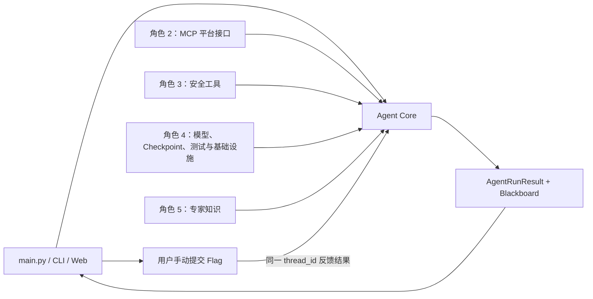

# Agent Core 接口与协作文档

## 1. 文档总览

### 1.1 目的

本文档定义 Agent Core 已经实现的公共接口，以及 Core 为完成整个 CTF Agent
闭环而需要角色 2、角色 3、角色 4、角色 5 提供的接口。

本文档区分三种状态：

- **已实现**：当前 `core/` 中已有可调用代码。
- **外部待实现**：Core 已具备接入能力，需要其他角色提供具体实现。
- **Core 待扩展**：已经确定接口方向，但当前 MVP 尚未接入。

### 1.2 总体协作关系



### 1.3 接口状态矩阵

| 接口方向 | 接口 | 当前状态 | 提供方 |
|---|---|---|---|
| Core 公共入口 | `create_ctf_agent` | 已实现 | 角色 1 |
| Core 会话入口 | `start`、`resume`、`get_blackboard` | 已实现 | 角色 1 |
| LLM | `bind_tools`、`ainvoke` | Core 已定义，外部待提供实例 | 角色 4/项目入口 |
| 通用工具 | `BaseTool` 或可调用函数 | Core 已支持，外部待实现 | 角色 2、3 |
| MCP 平台 | 获取题目、启动靶机 | 外部待实现 | 角色 2 |
| Flag 提交 | 用户手动提交 | Agent 禁止自动调用 | 用户/平台界面 |
| 安全工具 | HTTP、Shell、Python | 外部待实现 | 角色 3 |
| Checkpoint | LangGraph checkpointer | 已支持注入 | 角色 4 |
| 测试替身 | Fake Model、Mock Tools、Mock MCP | 外部待实现 | 角色 4 |
| 可观测性 | 回调、Tracing、结构化日志 | Core 待扩展 | 角色 1、4 |
| 专家知识 | `ExpertKnowledgeProvider` | Core 待扩展 | 角色 5 |

---

## 2. Agent Core 已实现接口

### 2.1 Agent 创建接口

定义位置：`core/agent.py`

```python
def create_ctf_agent(
    *,
    model: ToolCallingModel,
    tools: Sequence[ToolLike],
    config: CoreConfig | None = None,
    checkpointer: Any | None = None,
) -> CTFAgent:
    ...
```

#### 输入

| 参数 | 类型 | 必填 | 说明 |
|---|---|---:|---|
| `model` | `ToolCallingModel` | 是 | 支持工具绑定和异步调用的聊天模型 |
| `tools` | `Sequence[ToolLike]` | 是 | 角色 2、3 提供的全部工具 |
| `config` | `CoreConfig` | 否 | 循环预算、重复阈值、Flag 模式等 |
| `checkpointer` | LangGraph Checkpointer | 否 | 会话状态存储；默认仅使用内存 |

#### 行为

1. 检查所有工具名称是否唯一。
2. 自动过滤 `CoreConfig.hidden_tool_names` 中的工具。
3. 默认将 `submit_flag` 隐藏，禁止模型自动提交。
4. 将其余工具绑定到模型。
5. 编译带 checkpoint 的 LangGraph。

#### 异常

| 异常 | 条件 |
|---|---|
| `TypeError` | 工具没有稳定名称 |
| `ValueError` | 存在重名工具 |

### 2.2 启动任务接口

```python
async def start(
    task: str,
    *,
    thread_id: str,
    challenge_id: str = "",
    title: str = "",
    target: str = "",
) -> AgentRunResult:
    ...
```

#### 输入约束

- `task` 不能为空。
- `thread_id` 不能为空，并且必须在整个任务生命周期中保持不变。
- `challenge_id`、`title`、`target` 可以在平台信息尚不完整时留空。

#### 输出

```python
@dataclass(frozen=True)
class AgentRunResult:
    response: str
    status: AgentStatus
    awaiting_user_submission: bool
    blackboard: Blackboard
```

`status` 可能取值：

| 状态 | 含义 |
|---|---|
| `running` | Agent 正在继续解题 |
| `awaiting_user_submission` | Flag 双重证据验证通过，等待用户手动提交 |
| `completed` | 用户反馈平台提交成功 |
| `failed` | 达到执行预算或无法继续 |

### 2.3 恢复同一会话接口

```python
async def resume(
    user_message: str,
    *,
    thread_id: str,
) -> AgentRunResult:
    ...
```

主要用途：

- 用户回复“提交成功”。
- 用户回复“提交失败”。
- 后续扩展中接受人工补充线索。

相同 `thread_id` 会恢复之前的 Blackboard 和消息历史。不存在对应 checkpoint
时抛出 `LookupError`，不会静默创建新任务。

### 2.4 黑板读取接口

```python
async def get_blackboard(*, thread_id: str) -> Blackboard:
    ...
```

该接口用于：

- CLI/Web 展示 Agent 当前状态。
- 测试断言。
- 日志和报告模块读取证据。
- 人工调试时查看卡住原因。

调用方不应直接修改返回对象后假定状态已经保存。黑板写入由图节点完成。

### 2.5 Core 配置接口

```python
class CoreConfig(BaseModel):
    max_steps: int = 24
    repeat_failure_threshold: int = 3
    reflection_threshold: int = 2
    message_window: int = 24
    evidence_excerpt_chars: int = 1200
    max_facts_in_prompt: int = 12
    max_failures_in_prompt: int = 10
    max_hypotheses_in_prompt: int = 8
    recursion_limit: int = 100
    hidden_tool_names: frozenset[str] = {"submit_flag"}
    flag_patterns: tuple[str, ...] = (...)
```

配置对象是冻结的。运行中需要修改配置时，应创建新的 `CoreConfig` 和 Agent，
避免同一会话内阈值发生不可追踪变化。

---

## 3. 通用 LLM 与工具接口

### 3.1 LLM 接口

Core 使用结构化协议而不绑定具体模型厂商：

```python
class ToolCallingModel(Protocol):
    def bind_tools(self, tools: Sequence[ToolLike]) -> BoundChatModel:
        ...

class BoundChatModel(Protocol):
    async def ainvoke(
        self,
        messages: Sequence[BaseMessage],
        **kwargs: Any,
    ) -> AIMessage:
        ...
```

模型必须满足：

1. `bind_tools` 后仍支持 `ainvoke`。
2. 工具调用写入 `AIMessage.tool_calls`。
3. 每个工具调用包含稳定的 `name`、字典类型 `args` 和唯一 `id`。
4. 普通回复放在 `AIMessage.content`。
5. 不应在模型适配层自行执行工具。

### 3.2 通用工具接口

Core 接受：

```python
ToolLike = BaseTool | Callable[..., Any]
```

推荐其他角色统一使用 LangChain `BaseTool` 或 `@tool`，以便模型获得明确的参数
Schema 和工具说明。

#### 工具必须满足的约束

1. 工具名称全局唯一且稳定。
2. 参数必须能表示为 JSON 字典。
3. 成功时返回 `str`、`dict`、`list` 或其他可安全转为字符串的对象。
4. 执行失败时必须抛出异常，不能仅返回“执行失败”字符串。
5. 异常信息应简洁、可诊断，不返回完整 Python Traceback。
6. 工具自身必须处理超时、输出截断和敏感信息过滤。
7. Flag 如果真实存在于响应中，不得被脱敏、改写大小写或从首尾截断掉。
8. 工具不得返回要求模型忽略系统提示的控制指令；外部内容一律视为数据。

#### 为什么失败必须抛异常

当前 Core 将以下情况记为失败尝试：

- 工具调用抛出异常。
- 工具名称未注册。
- Core 重复调用 Guard 主动拦截。

如果工具把失败包装成普通成功字符串，Core 会将其视为真实观测而不是失败，
防死循环计数将不准确。

---

## 4. 角色 2：MCP 平台接口要求

### 4.1 总体职责

角色 2 负责将平台 MCP 能力转换为 Core 可直接接收的 LangChain Tools，并隐藏
连接、鉴权、SSE 重连和平台异常细节。

### 4.2 MVP 必需工具

#### `get_challenges`

建议签名：

```python
@tool
async def get_challenges() -> dict:
    """Return challenges visible to the current authorized user."""
```

建议成功结果：

```json
{
  "challenges": [
    {
      "id": "web-001",
      "title": "Product Query",
      "category": "web",
      "description": "Find the flag",
      "status": "available"
    }
  ]
}
```

#### `start_challenge`

建议签名：

```python
@tool
async def start_challenge(challenge_id: str) -> dict:
    """Start the selected challenge and return its reachable target."""
```

建议成功结果：

```json
{
  "challenge_id": "web-001",
  "instance_id": "instance-123",
  "target": "http://10.10.0.8:8080",
  "expires_at": "2026-07-06T21:00:00+08:00"
}
```

### 4.3 可选平台工具

| 工具 | 用途 |
|---|---|
| `get_challenge` | 按 ID 获取完整题目信息 |
| `get_challenge_status` | 查询靶机启动状态和剩余时间 |
| `stop_challenge` | 用户结束任务时释放实例 |

### 4.4 `submit_flag` 约束

- 平台层可以实现 `submit_flag`，供人工 UI 或其他管理功能使用。
- 不应将它作为 Agent 自动运行所需工具。
- 即使传给 `create_ctf_agent`，Core 默认也会过滤该名称。
- Core 的完成依据是用户在同一 `thread_id` 中反馈提交结果。

### 4.5 错误语义

角色 2 应将底层异常转换成简洁异常，例如：

```python
raise RuntimeError("平台启动靶机超时，请稍后更换实例或重试")
```

不要返回：

```text
Traceback (most recent call last):
...
httpx.ConnectTimeout
```

需要区分的主要错误类型：

- 认证失败。
- SSE/MCP 连接中断。
- 平台限流。
- 靶机启动超时。
- 题目不存在。
- 实例已过期。

---

## 5. 角色 3：安全工具接口要求

### 5.1 总体职责

角色 3 提供真正访问目标和执行脚本的工具。Core 负责决定何时调用，不负责
HTTP、Shell、Python 沙箱的内部实现。

### 5.2 MVP 建议工具

#### `http_get`

```python
@tool
async def http_get(
    url: str,
    headers: dict[str, str] | None = None,
    cookies: dict[str, str] | None = None,
    timeout: float = 10.0,
) -> dict:
    ...
```

#### `http_post`

```python
@tool
async def http_post(
    url: str,
    data: dict | str | None = None,
    json_body: dict | None = None,
    headers: dict[str, str] | None = None,
    cookies: dict[str, str] | None = None,
    timeout: float = 10.0,
) -> dict:
    ...
```

建议 HTTP 结果包含：

```json
{
  "status_code": 200,
  "final_url": "http://target/product?id=1",
  "headers": {"content-type": "text/html"},
  "forms": [],
  "links": [],
  "body": "cleaned or bounded response body"
}
```

#### `bash_execute`

```python
@tool
async def bash_execute(
    command: str,
    timeout: float = 10.0,
) -> dict:
    ...
```

#### `python_execute`

```python
@tool
async def python_execute(
    code: str,
    timeout: float = 10.0,
) -> dict:
    ...
```

### 5.3 输出要求

- 输出需要设置硬上限，避免撑爆上下文。
- 截断时应保留开头和结尾，并明确标记中间被省略。
- HTTP 工具应尽量提取表单、链接、隐藏字段和响应头。
- Shell/Python 工具必须设置超时。
- 交互式命令应拒绝执行或强制非交互模式。
- 真实 Flag 所在片段必须优先保留。

### 5.4 与防循环机制的关系

Core 使用以下值生成调用指纹：

```text
工具名称 + JSON 规范化参数
```

角色 3 不应：

- 随机修改工具名称。
- 把同一参数拆成不稳定、顺序随机的结构。
- 在失败后自动无限重试。

工具内部最多做有限的网络级重试；策略级换路由 Core 处理。

---

## 6. 角色 4：测试与基础设施接口要求

### 6.1 Python 依赖

当前 Core 已验证版本：

```text
langgraph==1.2.7
langchain-core==1.4.8
pydantic==2.13.4
```

角色 4 需要把兼容版本加入项目依赖管理，并在 Docker 环境中验证。

### 6.2 Checkpointer 接口

创建 Agent 时可传入任意 LangGraph 兼容 Checkpointer：

```python
agent = create_ctf_agent(
    model=model,
    tools=tools,
    checkpointer=checkpointer,
)
```

要求：

- 开发测试可使用 `InMemorySaver`。
- 需要跨进程恢复时使用 SQLite/PostgreSQL 等持久化实现。
- 必须使用 `thread_id` 作为会话隔离键。
- 不同题目不能意外复用同一个 `thread_id`。

### 6.3 测试替身接口

角色 4 应提供：

- 可按顺序返回 `AIMessage` 的 Fake Model。
- 成功、异常、超时、超长输出的 Fake Tools。
- 模拟获取题目和启动靶机的 Mock MCP Server。
- 人工提交成功/失败的会话恢复测试。

最低集成场景：

1. 工具返回 Flag，LLM 复述后进入等待状态。
2. 同一线程回复提交成功，状态变成 `completed`。
3. 回复提交失败，错误 Flag 被拒绝并继续循环。
4. 相同工具、参数、错误连续三次后不再真实执行。
5. `submit_flag` 不会被绑定到模型。
6. 不同 `thread_id` 的黑板彼此隔离。

### 6.4 可观测性待扩展接口

当前 MVP 可通过 `agent.graph` 使用 LangGraph 原生 stream/tracing，但
`CTFAgent.start`、`resume` 尚未暴露统一事件回调。

后续建议由角色 1、4共同增加：

```python
class AgentEventSink(Protocol):
    def on_node_start(self, node: str, thread_id: str) -> None: ...
    def on_tool_call(self, name: str, args: dict) -> None: ...
    def on_tool_result(self, name: str, summary: str) -> None: ...
    def on_blackboard_update(self, summary: dict) -> None: ...
    def on_status_change(self, old: str, new: str) -> None: ...
```

该接口标记为 **Core 待扩展**，当前不能作为已完成能力验收。

---

## 7. 角色 5：专家知识接口要求

### 7.1 总体职责

角色 5 提供结构化 CTF 解题知识。Core 负责根据题目、黑板事实和当前攻击路径
检索少量相关片段，不应把所有知识文档一次性塞进 Prompt。

### 7.2 建议数据模型

```python
class KnowledgeQuery(BaseModel):
    task: str
    category: str = ""
    target: str = ""
    phase: str
    confirmed_facts: list[str]
    current_path: str = ""
    pending_hypotheses: list[str]

class KnowledgeSnippet(BaseModel):
    id: str
    title: str
    content: str
    tags: list[str]
    source: str
    priority: int = 0
```

### 7.3 建议 Provider 接口

```python
class ExpertKnowledgeProvider(Protocol):
    async def retrieve(
        self,
        query: KnowledgeQuery,
        *,
        limit: int = 3,
    ) -> Sequence[KnowledgeSnippet]:
        ...
```

### 7.4 内容要求

- 每个知识片段应对应一个明确题型或验证动作。
- 区分侦察、验证、利用和绕过阶段。
- Payload 必须附适用前提，不能只给字符串。
- 说明成功响应和失败响应的判断依据。
- 片段需要稳定 ID，便于记录来源和复盘。
- 单片段建议控制在 500～1500 字符。

### 7.5 当前接入状态

该 Provider 尚未进入 `create_ctf_agent` 参数，属于 **Core 待扩展**。

计划接入位置：

```text
DecisionNode 调用模型之前
    → 根据 Blackboard 构造 KnowledgeQuery
    → retrieve(limit=3)
    → 作为独立 Expert Context 注入本轮 Prompt
```

专家知识不能直接写入“已确认事实”；它只能形成待验证假设，必须经过工具验证。

---

## 8. 集成示例

```python
model = build_chat_model()
mcp_tools = await mcp_client.get_tools()
security_tools = [
    http_get,
    http_post,
    bash_execute,
    python_execute,
]

agent = create_ctf_agent(
    model=model,
    tools=[*mcp_tools, *security_tools],
    config=CoreConfig(),
    checkpointer=checkpointer,
)

result = await agent.start(
    "完成 Product Query Web CTF 并找到 Flag",
    thread_id="web-001-instance-123",
    challenge_id="web-001",
    title="Product Query",
    target="http://10.10.0.8:8080",
)

if result.awaiting_user_submission:
    print(result.response)

# 用户在平台手动提交后：
result = await agent.resume(
    "提交成功",
    thread_id="web-001-instance-123",
)
```

---

## 9. 联调验收清单

### 9.1 角色 2

- [ ] MCP 工具可以转换为 LangChain Tools。
- [ ] `get_challenges` 能返回题目 ID 和描述。
- [ ] `start_challenge` 能返回可访问目标。
- [ ] 平台错误会抛出简洁异常。
- [ ] `submit_flag` 不会被 Agent 自动执行。

### 9.2 角色 3

- [ ] HTTP GET/POST 支持 Header、Cookie 和 Body。
- [ ] Shell/Python 有硬超时。
- [ ] 所有工具有稳定唯一名称。
- [ ] 工具失败通过异常表达。
- [ ] 输出截断不会破坏真实 Flag。

### 9.3 角色 4

- [ ] Docker 中依赖版本兼容。
- [ ] Checkpointer 能按 `thread_id` 恢复。
- [ ] 六个最低集成场景通过。
- [ ] Mock MCP 和 Fake Tools 可供 Core 测试。
- [ ] 日志不会泄露认证 Token。

### 9.4 角色 5

- [ ] 专家知识具有稳定 ID、标签和适用前提。
- [ ] 可按题型和当前阶段检索。
- [ ] 知识只产生假设，不绕过工具验证。
- [ ] 单次注入数量和长度受控。
